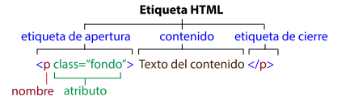

# Etiquetas

Las etiquetas (marcas) delimitan cada uno de los elementos que componen un documento HTML.

El lenguaje HTML se basa en etiquetas, por eso es importante entender bien la sintaxis de las etiquetas. El siguiente esquema muestra las partes de una etiqueta HTML genérica.



La etiqueta de apertura está delimitada por el signo `<`, a continuación el propio nombre de la etiqueta (en este caso p), y opcionalmente un atributo (en este caso class="fondo"), finalmente el signo `>`.

A continuación está el texto del contenido de la etiqueta, lo más frecuente es un texto, pero podría ser otra etiqueta, una imagen, ...

La etiqueta de cierre está delimitada por el signo `<` , a continuación la barra inclinada `/`, el propio nombre de la etiqueta (en este caso p), y finalmente el signo `>`.


Algunas etiquetas no tienen contenido, y se cierran sobre sí mismas, no tienen etiqueta de cierre, se llaman etiquetas vacías, como la etiqueta `<br>`. En estas etiquetas opcionalmente se puede colocar una barra justo antes del signo `>`, por ejemplo: `<br />`, esta etiqueta produce un salto de línea. Las etiquetas vacías no tienen contenido pero si pueden tener atributos. Algunas otras etiquetas vacías son  `<hr>, , <input>, <link>, <meta>, <param> y <source>.`

Ejemplo:

`<a href="https://www.w3schools.com/">w3school</a>`

Produce:

[w3school](https://www.w3schools.com/)

En general las etiquetas se pueden anidar pero no se pueden 'cruzar'. Estas dos etiquetas `<p>` y `<div>`, están anidadas correctamente:

```
<div>
<p>
Texto del párrafo
</p>
</div>
```

Es incorrecto cruzarlas así:

```
<div>
<p>
Texto del párrafo
</div>
</p>
```

Las etiquetas son anidadas usando una pila por lo cual la primera en abrir debe ser la ultima en ser cerrada.

### Ejemplo

```
<html>
    <head>
        <title>
            Encabezado web
        </title>
    </head>
    <body>
    <h1>
        Titulo
    </h1>
    <p>
        Mi primer pagina web
    </p>
    </body>
</html>
```

[codigo](codigos/clase_02_practica_01.html)


La primera línea  `<!DOCTYPE ... >` no es propiamente una etiqueta de HTML, sino una declaración o instrucción al navegador sobre la versión de HTML que utiliza la página. Para la versión HTML 5, el tipo de documento es html: `<!DOCTYPE html>`

El resto del documento HTML está contenido dentro de la etiqueta `<html></html>`. Para indicar el idioma es conveniente añadir el atributo lang="es": `<html lang="es"></html>`


Las etiquetas que pueden ir dentro de `<head>` son `<title> <style> <base> <link> <meta> <script> <noscript>`.


## Datos básicos de algunas etiquetas

- `<head></head>`, encabezado, para optimizar la página para diferentes anchos de pantalla, también es conveniente definir el viewport, por ejemplo de esta forma: `<meta name="viewport" content="vwidth=device.width, initial-scale=1.0">`.
- `<title></title>` contiene el título de la página que es lo que se ve en la barra de título del navegador
- `<body>` encontramos el contenido de la página, lo que se ve a través del navegador: texto, imágenes, enlaces, tablas, etc... Por lo tanto dentro del `<body>` pueden ir la gran mayoría de las etiquetas html.
- `<p></p>`  identifican parrafos, los parrafos no deben sub-anidarse en otros parrafos.
    - Atributos. Hasta la aparición de la versión HTML 5, existía el atributo align para alinear el contenido del párrafo, con los valores rigth, center, left.
```
<p align="right">Contenido alineado a la derecha</p>
```
A partir de HTML 5, se debe alinear el contenido desde la hoja de estilo con el atributo text-align y los valores rigth, center, left, justify, initial, inherit.

La etiqueta `<p>` es de tipo bloque, es decir, por defecto ocupa una línea completa en la página web. Además, también incluye un margen superior e inferior. Por ejemplo, si escribimos dos párrafos en la misma línea: 
```
<p>Un párrafo de texto.</p><p>Otro párrafo.</p>
```
Produce
```
Un párrafo de texto.

Otro párrafo.
```
Si el contenido del párrafo no cabe en una línea será el navegador web quien lo divida en varias líneas según el ancho disponible. Por lo tanto, el número de líneas que ocupe un párrafo dependerá del ancho disponible. Si queremos incluir un salto de línea explícito dentro de un párrafo podemos utilizar la etiqueta `<br />`.
Dentro del párrafo se suele introducir texto pero también se pueden incluir otros elementos, como imágenes y elementos de texto (span, em, b, etc.), aunque no se pueden incluir listas y tablas, o no deberían.

- Los encabezados van desde el `<h1></h1>` de mayor tamaño, al `<h6></h6>`, el más pequeño.
- `&nbsp;` espacios, como funcionan los espacios  y los saltos de linea en html.
- `<br/>` equivale a un intro.
- Para agrupar el contenido dentro de la página web es con las etiquetas `<div>` y `<span>`:
    - La etiqueta `<div>` se utiliza a nivel de bloque.
    - La etiqueta `<span>` a nivel de línea o palabras.
- En HTML 5 han surgido nuevas etiquetas semánticas para agrupar el contenido según su significado. Estas nuevas etiquetas a nivel de bloque son, `section` para secciones, `article` para artículos, `header` para cabeceras, `nav` para menús, `footer` para pies de página y `aside` para contenido en el lateral. A nivel de línea o texto tenemos muchas etiquetas semánticas como `strong`, `em`, `cite`.
- Otras etiquetas para agrupar y organizar el contenido (texto, imágenes, ...) en formatos estructurados son las listas (ul, ol, li) y las tablas (table, tr, td), veremos más adelante ejemplos de todos estos tipos.

## Ejercicio

 Crear una página donde utilicen cada uno de estos elementos.


