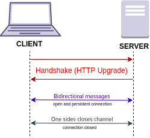

# Websockets

## El protocolo Websocket

El protocolo WebSocket permite la comunicación bidireccional entre un cliente que esta ejecutando código que no es confiable en un ambiente controlado a un host remoto que ha optado por recibir comunicaciones desde ese código. 

El modelo conmunmente utilizado para asegurar esta comunicación es el modelo de seguridad basado en el origen(origin-based security model) que es implementado por los navegadores web.



El protocolo consiste en un `opening handshake` seguido de un encuadre de mensaje básico, en capas sobre TCP.

El objetivo de esta tecnología es proporcionar un mecanismo para que webapps que necesitan comunicación bidireccional con servidores, lo cuales no basan su comunicación abriendo multiples conecciones HTTP.


## Un poco de Historia

Muchas aplicaciones web necesitan establecer comunicacion bidireccional entre el cliente y el servidor, como por ejemplo, la mensajeria instantanea o los video juegos. Usualmente se abusa del protocolo HTTP, lo cual provoca una serie de problemas:

- El servidor es forzado a usar un numero de diferentes conexiones TCP para cada uno de los clientes, uno para enviar mensajes al cliente y otro para escuchar mensajes.
- El protocolo wire tiene un gran overhead, con cada mensaje cliente-servidor conteniendo un HTTP header.
- El script del lado del cliente es forzado a mantener un mapeo de las conexiones salientes hacia las conexiones entranetes con el fin de dar seguimiento a las respuestas.


Una simple solution deberia ser usar una única conexión TCP para el trafico en ambas direcciones. Esto es justamente lo que los websockets proveen. Combinados junto con WebSocker API (WSAPI) provee una alternativa al HTTP polling para la comunicación de una página web a un servidor remoto.

Como el protocolo websockets fue creado para sustituis las actuales comunicaciones HTTP que pudieran existir en la actual infraestructura, están hechos para trabajar  sobre los puertos 80 y 443, asi como soporta HTTP proxies e intermediarios.


## Overview


El protocolo tiene dos partes: un handshake y la transferencia de data.

El handshake del cliente se veria como lo siguiente:

```html
GET /chat HTTP/1.1
Host: server.example.com
Upgrade: websocket
Connection: Upgrade
Sec-WebSocket-Key: dGhlIHNhbXBsZSBub25jZQ==
Origin: http://example.com
Sec-WebSocket-Protocol: chat, superchat
Sec-WebSocket-Version: 13
```

Mientras que el handshake del servidor se veria como:

```html
HTTP/1.1 101 Switching Protocols
Upgrade: websocket
Connection: Upgrade
Sec-WebSocket-Accept: s3pPLMBiTxaQ9kYGzzhZRbK+xOo=
Sec-WebSocket-Protocol: chat
```

Una vez que el cliente y el servidor han enviado los hanshakes, y este handshake es exitoso, es entonces cuando la transferencia de datos inicia.
Cada uno puede enviar información sin restricciones.